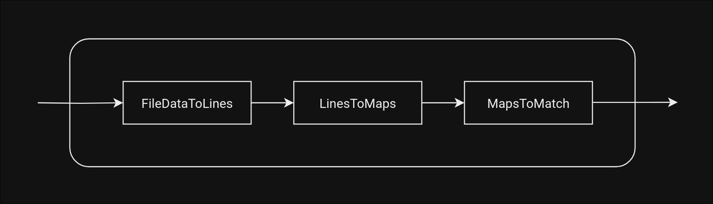
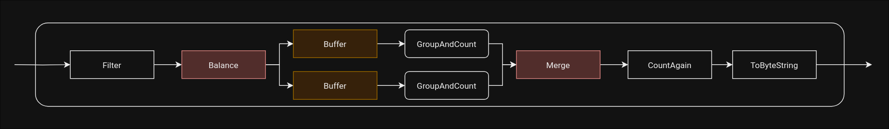
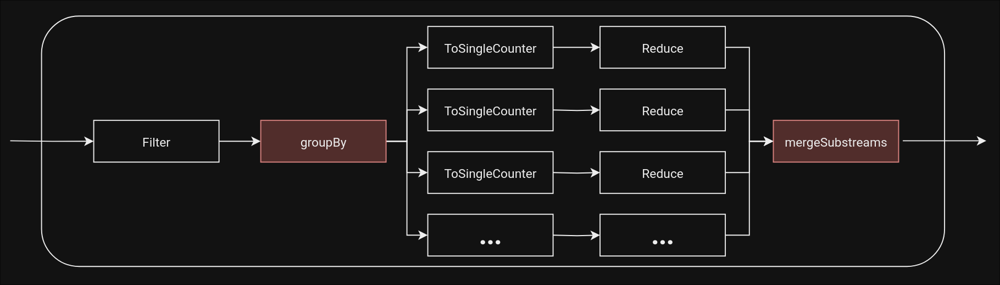

Software Architectures - Assignment 1: Akka Streams
===================================================

Introduction
------------
This document covers a description of my implementation of the Akka streams assignment, as well as an explanation for some of the design choices that were made.

Project Structure
-----------------

### File Structure
The file structure of the code base can be found in *Figure 1*. The `scala.Common.Constants` file simply contains all the constants, such as `bufferSize`, `resourceFolder`, the paths for the result files etc. The `scala.Common` folder also contains some classes that will be used by all the pipelines, and will be discussed in the next section. The `scala.QuestionFlows` folder contains the flow graphs for each question that we had to answer in the assignment, which are run in the `scala.Main` file.

```cs
.
├── resources
│   ├── basketball.csv
│   └── results
│       ├── Q1.txt
│       ├── Q2.txt
│       ├── Q3.txt
│       └── Q4.txt
└── scala
    ├── Common
    │   ├── Constants.scala
    │   ├── FileDataToMatch.scala
    │   ├── Match.scala
    │   └── MultiCounter.scala
    ├── Main.scala
    └── QuestionFlows
        ├── Question1.scala
        ├── Question2.scala
        ├── Question3.scala
        └── Question4.scala
```
<p align="center"><i>Figure 1: Structure of the pipelines to run the graphs of each question.</i></p>


### Pipeline Structures
Before diving into the details, it is worth noting that the diagrams show square and rounded components. The rounded components represent compound flows or `FlowGraphs`, while the others are just `Flows`.

The `Main.scala` file executes all the pipelines described on *Figure 2*. The source, which is the bytestring of the dataset file, is passed to the converter, which converts the file into `Match` objects. How the conversion works can be seen on *Figure 3*, which is exactly how data was read in WPO6. Those `Match` objects are then passed to the flowgraph of each question, and then finally to right sink, which writes the results into a result file. 


<p align="center"><i>Figure 2: Structure of the pipelines to run the graphs of each question.</i></p>


<p align="center"><i>Figure 3: Structure of the <tt>byteStringToMatchFlow</tt> graph.</i></p>

As mentioned earlier, each question has its own flow graph, but have the same general structure, which can be seen in *Figure 4*. The only place where they differ in is the filter at the start of the flow graph, and the `GroupAndCount` flow, which will be explained later on. The flows are balanced into two separate asynchronous pipelines, which both contains a buffer (orange component) each right at the boundary of the balancer. 


<p align="center"><i>Figure 4: General structure of the graphs of each question.</i></p>


<p align="center"><i>Figure 5: Structure of the <tt>GroupAndCount</tt> graph.</i></p>

`GroupAndCount` is also a flow that is used in all four pipelines, and is used to group the incoming data into substreams based on a specific attribute. For instance, the name of the winning team is used to group the data. After that, the data of every group is individually counted using the `reduce` operation,  

Elaboration on Design Choices
-----------------------------
[filter before balancing (pros & cons)(2 merges needed if we had to keep track of 0)]

`SingleCounter` is a class that simply keeps a string and a count, with a overloaded `+` operator. This makes it easy to reduce/fold  the results together in the pipeline. 

`MultiCounter` is similar to `SingleCounter`, except that it keeps track of counts of multiple strings at the same time, using a Map. This class is used to merge the partial results of the two balanced pipelines, of which one may contain the count of e.g. a team that is also partially counted by the other. 

The reason why I filter the stream before balancing the pipeline, is to make sure that the pipelines have a somewhat similar amount of work. This results in more parallellism, since they both run asynchronously. 
